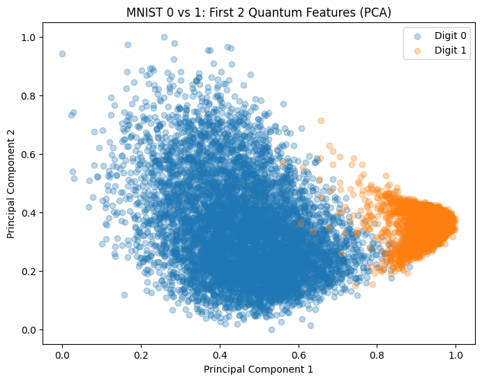

# Hybrid Quantum-Classical MNIST Classifier

This project implements a Variational Quantum Classifier (VQC) to distinguish between handwritten digits using a hybrid approach.

## 📊 Data Preprocessing
To make the MNIST dataset compatible with a 4-qubit quantum simulator, I developed a preprocessing pipeline:
* **Binary Filtering**: Focused the model on distinguishing between digits **0** and **1**.
* **Standardization**: Used `StandardScaler` to center pixel values, ensuring optimal performance for dimensionality reduction.
* **PCA (Dimensionality Reduction)**: Reduced the **784-pixel** images down to **4 principal components**.
* **Quantum Mapping**: Normalized features to a **[0, 1]** range using `MinMaxScaler` to represent quantum gate rotation angles.

## 📈 Visualizing the Latent Space
After reducing the data to 4 dimensions, the first two components show clear clustering, proving the data is separable before being fed into the quantum circuit:

